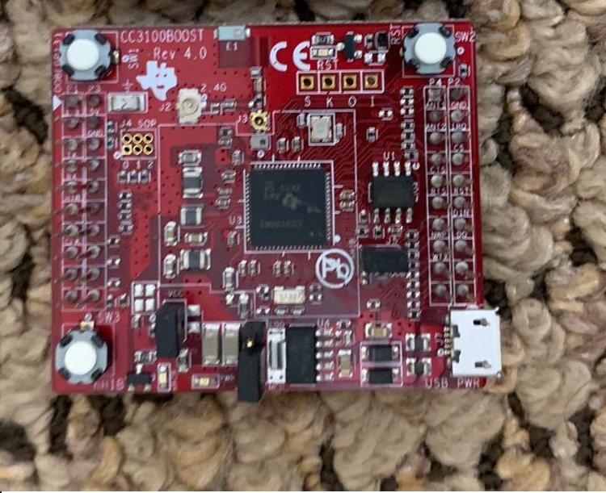
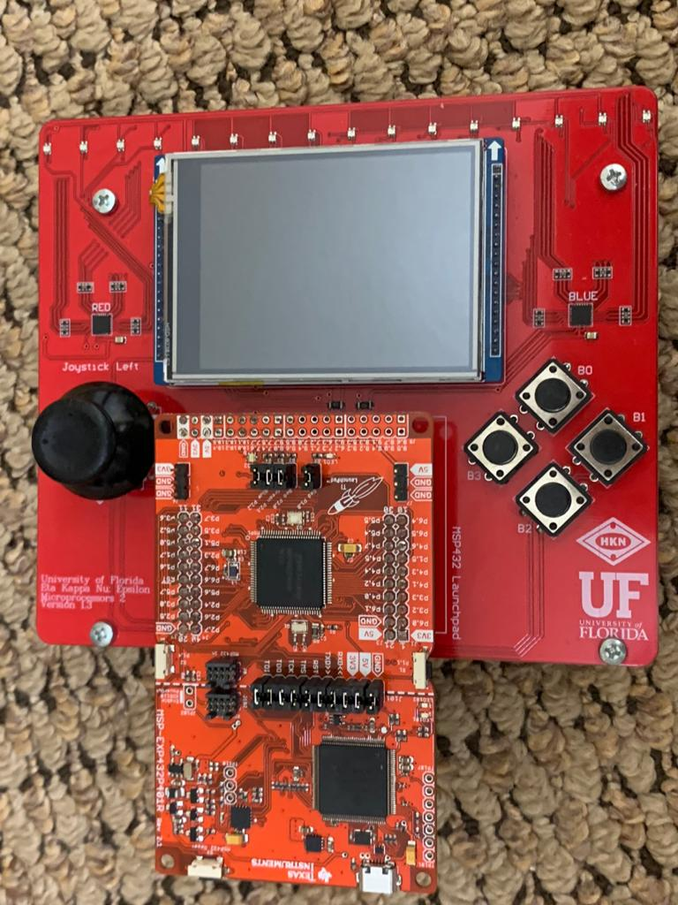

# Embedded-Real-Time-Applications:
This project served as a final project for Microprocessors applications II where student where paried and tasked with coming up with a final prooject for the class. The games use an Real time operating system (RTOS) created throughout the course. Lunchpad: TI MSP432 (ARM Cortex M4) Backpacks: TI CC3100 Wi-Fi® Network Processor

## Hardware used: 

- Devlopement board used for this project is the [MSP432](https://www.ti.com/product/MSP432P401R?utm_source=google&utm_medium=cpc&utm_campaign=epd-con-null-prodfolderdynamic-cpc-pf-google-wwe&utm_content=prodfolddynamic&ds_k=DYNAMIC+SEARCH+ADS&DCM=yes&gclid=CjwKCAjwnK36BRBVEiwAsMT8WNJew8yfEwyencFXfZz1lk2-7xudpZduXpiaQ3Wu68337mU4iZ0bFhoCgBIQAvD_BwE&gclsrc=aw.ds).
### Hardware limitations:
SRAM 64 KB
Due to the memory limitations we were only able to create two games that used the SRAM along with our drivers.
## Other backpacks: 
 - [CCS3100 BOOSTER PACK CC3100 WI-FI & IOT](https://www.digikey.com/product-detail/en/texas-instruments/CC3100BOOST/296-37769-ND/4862810?utm_adgroup=RF%2FIF%20and%20RFID&utm_source=google&utm_medium=cpc&utm_campaign=Shopping_Texas%20Instruments_0296_Co-op&utm_term=&utm_content=RF%2FIF%20and%20RFID&gclid=CjwKCAjw8df2BRA3EiwAvfZWaJutkkvgnPuYSjb0I8DprFYE4M8eggaCiC-Tff1q4PmoknfxObZhlxoCDgAQAvD_BwE) was used in this project to allow the development boards to commuincate via UDP or TCP. 

- Custom PCB created by UF HKN 

